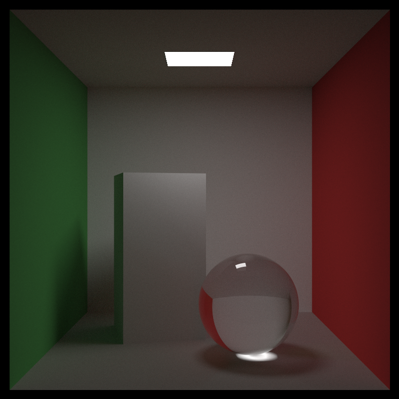
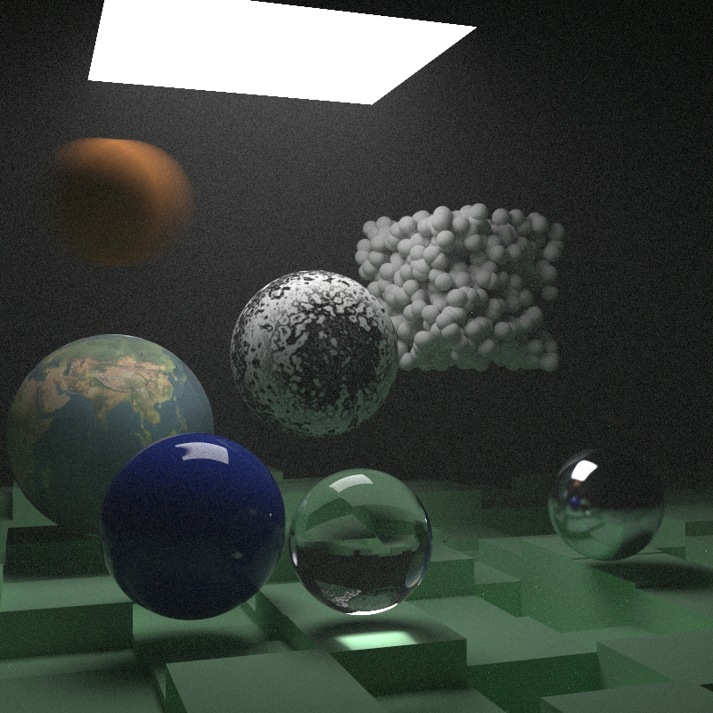
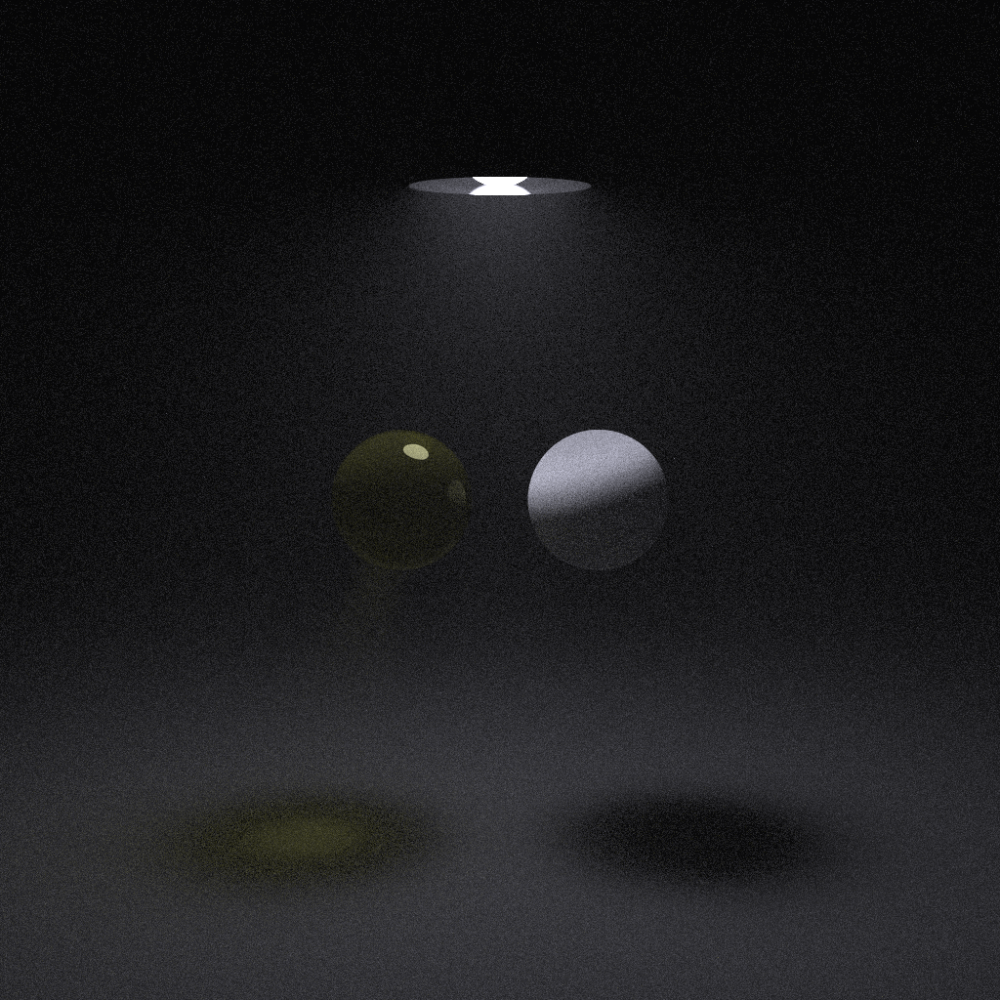

# Rust Ray Tracing

“Note that I avoid most “modern features” of C++, but inheritance and operator overloading are too useful for ray tracers to pass on.”  
― [Peter Shirley](https://research.nvidia.com/person/peter-shirley), [Ray Tracing in One Weekend](https://www.goodreads.com/book/show/28794030-ray-tracing-in-one-weekend)

Implemented with [Rust Programming Language](https://www.rust-lang.org/), based on [Peter Shirley's](https://research.nvidia.com/person/peter-shirley) books:

- ["Ray Tracing in One Weekend (Ray Tracing Minibooks Book 1)"](https://raytracing.github.io/books/RayTracingInOneWeekend.html)
- ["Ray Tracing: the Next Week (Ray Tracing Minibooks Book 2)"](https://raytracing.github.io/books/RayTracingTheNextWeek.html)
- ["Ray Tracing: The Rest of Your Life (Ray Tracing Minibooks Book 3)"](https://raytracing.github.io/books/RayTracingTheRestOfYourLife.html)

Crates:

- [Crate ray_tracing_core](https://docs.rs/ray_tracing_core/0.1.1/ray_tracing_core/)
- [Crate ray_tracing_utility](https://docs.rs/ray_tracing_utility/0.1.1/ray_tracing_utility/)
- [Crate ray_tracing_show_image](https://docs.rs/ray_tracing_show_image/0.1.1/ray_tracing_show_image/)

## Renderings

Cover scene "Ray Tracing: The Rest of Your Life"

Cover scene "Ray Tracing: the Next Week"

Cover scene "Ray Tracing in One Weekend"

Cover scene "Ray Tracing in One Weekend" with moving spheres

Spheres

Dielectric

Diffuse light

Blending material

Marble

Bitmap texture

Bitmap texture with alpha mask

Room

Volume

Mirror

Materials

Defocus blur

Motion blur

Checker texture

Noise texture

---

Recommended

- [PeterShirley/raytracing.github.io](https://github.com/RayTracing/raytracing.github.io)
- [PeterShirley/RayTraycingInOneWeekend](https://github.com/RayTracing/InOneWeekend)
- [PeterShirley/RayTraycingTheNextWeek](https://github.com/RayTracing/TheNextWeek)
- [PeterShirley/RayTraycingTheRestOfYourLife](https://github.com/RayTracing/TheRestOfYourLife)
- [Ray Tracing in C#](https://github.com/Rabbid76/c_sharp_raytrace_examples)
- [PyGame Ray tracing](https://github.com/Rabbid76/PyGameRayTracing)